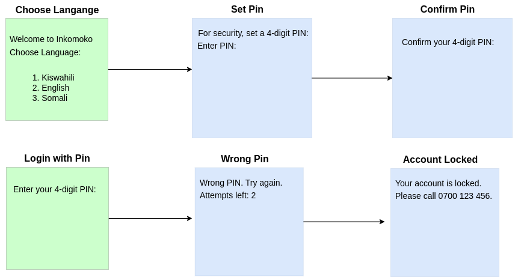

## Test USSD Menu FLow
 This repo contains a simple ussd menu application that is provided as part of techincal fitness assesement test for a Junub SMS project.
The developer is required to implement, transalate  the ussd flow diagram below into a working ussd application. Typically, we would like to see at glance how a developer handles session state and persistence for the ussd menu, data storage and general application architecture practices.

### USSD aggregator integration details

__Protocol__: HTTP  
__Method__: GET  
__query string__:  
  - `MSISDN` (phone of the subscriber that initiated the ussd session)
  - `INPUT`  (The data the user typed or sent to the ussd application, the first data is usually initiation short code e.g *183#)
  - `SessionId` (A unique identifier sent by the telco to identify the session)

#### Example request from the telco

http://localhost:9090/ussd_handler.py?MSISDN=211925415377&INPUT=*183#&SessionId=g5767fnn5

#### Sample Response from the application

__Continue Session__: Send header in the response `FreeFlow: FC`
__Terminate Session__: Send header in the response `FreeFlow: FB`
__Content Type__: Send header in the response: `Content_Type: utf-8`
__Response body__: A formatted ascii text representing a menu or data for the user


### Technical Architecture stack

Use any development stack you are confortable. Please keep the code clean and readable.
Use modern software development best practices e.g properly linted code, comments etc

### Configuration

The application uses environment variables for configuration. These can be set in the `.env` file:

```
# Server port number
PORT=8090

# USSD shortcode (used for display/logging)
USSD_CODE=*183#

# Session timeout in milliseconds (5 minutes)
SESSION_TIMEOUT=300000

# Maximum PIN attempts before account lockout
MAX_PIN_ATTEMPTS=3

# Default language (en, sw, so)
DEFAULT_LANGUAGE=en
```

### Sample flow menu application


## Documentation

### Setup

1. Clone this repository
2. Copy `.env.example` to `.env` and modify as needed
3. Install dependencies:
   ```
   npm install
   ```

### Testing Environment

This application was tested with:
- Node.js v22.19.0
- Operating System:  Ubuntu 22.04 LTS ("Jammy Jellyfish").
- No external dependencies beyond dotenv

### Running the Server

**Start server:**
```
node src/index.js
```

**Stop server:** Press `Ctrl+C` in the terminal

### Interacting with the Application

Send HTTP GET requests to the USSD endpoint:

**Initial Request (dial *183#):**
```
curl -i 'http://localhost:9090/ussd?MSISDN=211925415377&INPUT=*183%23&SessionId=test123'
```

**Language Selection (select English):**
```
curl -i 'http://localhost:9090/ussd?MSISDN=211925415377&INPUT=*183%23*2&SessionId=test123'
```

**Set PIN:**
```
curl -i 'http://localhost:9090/ussd?MSISDN=211925415377&INPUT=*183%23*2*1234&SessionId=test123'
```

**Confirm PIN:**
```
curl -i 'http://localhost:9090/ussd?MSISDN=211925415377&INPUT=*183%23*2*1234*1234&SessionId=test123'
```

**Logout:**
```
curl -i 'http://localhost:9090/ussd?MSISDN=211925415377&INPUT=*183%23*2*1234*1234*1&SessionId=test123'
```

## Limitations

### Data Persistence
- **In-memory Session Storage**: Session data is stored in memory and doesn't persist between server restarts. In production, use Redis or a database-backed session store.
- **File-based User Data**: User data is loaded from `data/users.js` at startup but changes (e.g., PIN updates) are only stored in memory. In production, replace with a PostgreSQL or MongoDB database.
- **No Data Persistence**: All changes made during runtime (setting PINs, language preferences) are lost when the server restarts.

### Infrastructure
- **Simple HTTP Server**: This application uses Node.js built-in HTTP server, which is suitable for demonstration but not for production loads. In production, use Express.js or Next.js with Nginx.
- **No Security Features**: This demo lacks proper security implementations like hashed PINs, HTTPS, rate limiting, and secure headers that would be required in production.
- **No Logging/Monitoring**: A production application would include proper logging and monitoring solutions.

### Development Practices
- **No Automated Tests**: This demo doesn't include unit, integration, or end-to-end tests that would be essential in a production application.
- **No CI/CD Pipeline**: A production application would have automated build, test, and deployment pipelines using tools like GitHub Actions, Jenkins, or GitLab CI.
- **Limited Error Handling**: The error handling is basic and would need to be more robust in a production system.
- **No API Documentation**: A production API would have formal documentation using tools like Swagger/OpenAPI.
- **No Version Control Strategy**: A real project would have a defined branching strategy and code review process.
